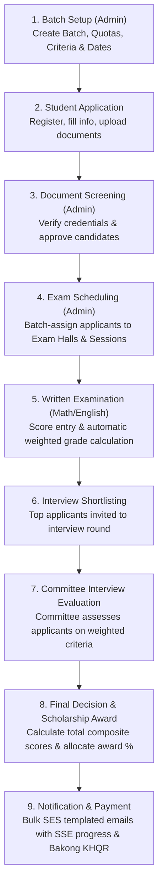

# ScholarPro — Scholarship Management System

[](https://nodejs.org/)
[](https://www.typescriptlang.org/)
[-black.svg)](https://nextjs.org/)
[](https://react.dev/)
[](https://expressjs.com/)
[](https://www.postgresql.org/)
[](https://orm.drizzle.team/)
[](https://tailwindcss.com/)

ScholarPro is an enterprise-grade, full-lifecycle scholarship management platform built for academic institutions and universities. It streamlines the entire scholarship workflow—from public student discovery, application submission, and document verification to examination scheduling, criteria-based committee scoring, Bakong KHQR application fee payment, and automated bulk email announcements with real-time progress tracking.

---

## Table of Contents

- [Overview & Architecture](#overview--architecture)
- [Key Features by User Role](#key-features-by-user-role)
- [Scholarship Lifecycle (How It Works)](#scholarship-lifecycle-how-it-works)
- [Technology Stack](#technology-stack)
- [Repository Structure](#repository-structure)
- [Prerequisites](#prerequisites)
- [Local Setup & Getting Started](#local-setup--getting-started)
  - [1. Clone the Repository](#1-clone-the-repository)
  - [2. Generate RSA Keypair (RS256 JWT)](#2-generate-rsa-keypair-rs256-jwt)
  - [3. Setup PostgreSQL Database](#3-setup-postgresql-database)
  - [4. Backend Setup & Run](#4-backend-setup--run)
  - [5. Frontend Setup & Run](#5-frontend-setup--run)
- [Default Seeded Credentials](#default-seeded-credentials)
- [Environment Variables Reference](#environment-variables-reference)
- [Email System & Background Workers](#email-system--background-workers)
- [Security & Authentication Model](#security--authentication-model)
- [Available Scripts & Commands](#available-scripts--commands)
- [Production Deployment](#production-deployment)
- [Troubleshooting & FAQs](#troubleshooting--faqs)

---

## Overview & Architecture

ScholarPro is designed as **two independent applications** hosted within a single repository:

1. **Backend (`backend/`)**: High-performance RESTful API built with **Express.js**, **TypeScript**, and **Drizzle ORM** communicating with a **PostgreSQL** database. Includes asynchronous workers, rate limiting, and integrations with AWS SES, Bakong KHQR, Google OAuth, Telegram, and Sentry.
2. **Frontend (`frontend/`)**: Modern responsive web application built with **Next.js 16 (App Router)**, **React 19**, **Tailwind CSS v4**, and **Zustand**. Provides custom portals for Students, Committees, and Administrators.

```
                      ┌────────────────────────────────────────┐
                      │          Web Browser (Client)          │
                      │  Port 3001 (Dev) / Port 80/443 (Prod)  │
                      └───────────────────┬────────────────────┘
                                          │
                        HTTP Requests / SSE / Next.js SSR
                                          │
                                          ▼
                      ┌────────────────────────────────────────┐
                      │        Frontend (Next.js 16)           │
                      │  • /students (Student Portal)          │
                      │  • /(dashboard) (Admin/Committee)      │
                      │  • proxy.ts (Auth Gate & CSP Nonce)    │
                      │  • In-Memory Access Token (Zustand)    │
                      └───────────────────┬────────────────────┘
                                          │
                          API Proxy: /api/* -> /api/v1/*
                                          │
                                          ▼
                      ┌────────────────────────────────────────┐
                      │        Backend API (Express.js)        │
                      │  • Port 3000                           │
                      │  • RS256 JWT Sign & Verify             │
                      │  • Zod Request Validation              │
                      │  • Controllers -> Services -> Drizzle  │
                      └──┬─────────────────┬─────────────────┬─┘
                         │                 │                 │
                         ▼                 ▼                 ▼
             ┌───────────────┐     ┌───────────────┐ ┌────────────────┐
             │  PostgreSQL   │     │  AWS SES v2   │ │ Bakong KHQR    │
             │  (DrizzleKit) │     │ (Email Queue) │ │ Payment Engine │
             └───────────────┘     └───────────────┘ └────────────────┘
```

> [!NOTE]
> **No Root `package.json`**: This project intentionally does not use npm workspaces or a root `package.json`. Dependencies and scripts must be run directly inside [`backend/`](file:///c:/src/ScholarProV2/backend) or [`frontend/`](file:///c:/src/ScholarProV2/frontend).

---

## Key Features by User Role

### 🎓 1. Student Portal (`/students/*`)
- **Self-Service Onboarding**: Register via local email/password, Google OAuth 2.0, or Telegram Login widget.
- **Application Submission**: Multi-step application submission including personal info, parent/guardian data, high school background, and department/faculty priorities.
- **Document Attachments**: Secure file upload for transcripts, national identity cards, letters of recommendation, and profile pictures.
- **Examination Hall Ticket**: Real-time access to assigned examination dates, start/end times, exam subjects (Mathematics, English), and room locations.
- **Live Progress & Results**: Track application stages (`submitted` → `screened` → `exam_scheduled` → `interview_scheduled` → `awarded`), inspect exam scores, and view awarded scholarship percentages (e.g. 25%, 50%, 75%, 100%).
- **KHQR Payment**: Seamless fee settlement using National Bank of Cambodia Bakong KHQR payment standard with real-time payment status polling.

### 👥 2. Evaluation Committee Portal (`/(dashboard)/*`)
- **Applicant Review**: Review applicant dossiers, attached certificates, and academic history.
- **Interview Scoring**: Score shortlisted applicants during live interviews across customizable weighted criteria (e.g. *Communication Skills (30%)*, *Technical Knowledge (40%)*, *Problem Solving (30%)*).
- **Exam Session Monitoring**: View schedules and attendee rosters for assigned examination sessions.

### 🛡️ 3. Administrative Portal (`/(dashboard)/*`)
- **Cohort & Batch Management**: Configure academic batches, dates, eligibility criteria, and quota limits.
- **Academic Framework Configuration**: Manage faculties, departments, majors, tuition fees, subjects, and scoring weights.
- **Automated Scheduling Engine**: Assign hundreds of applicants to exam sessions and physical examination halls based on capacity constraints.
- **AWS SES Email Communications**:
  - WYSIWYG template builder with dynamic variable substitution (`{{applicantName}}`, `{{major}}`, `{{scholarshipPercentage}}`, etc.).
  - Bulk email queue system processing 50 emails/minute with rate-limit protection.
  - Server-Sent Events (SSE) live progress bar showing real-time sent/failed counts.
- **User & Access Management**: Invite committee members, assign department affiliations, manage roles, and review audit/login history.

---

## Scholarship Lifecycle (How It Works)



1. **Batch Setup**: Administrator creates an active academic batch with start/end dates and subject weightings.
2. **Student Submission**: Students register, fill out details, choose target majors, upload supporting documents, and pay any required processing fees via Bakong KHQR.
3. **Screening**: Administrators review applications and mark eligible applicants for written examination.
4. **Exam Scheduling**: The scheduling system assigns applicants to specific examination halls and sessions based on capacity.
5. **Written Exam**: Written exams (Mathematics, English) are administered, and evaluators input grades.
6. **Interview Shortlist**: High-ranking applicants are automatically or manually advanced to interview sessions.
7. **Interview Evaluation**: Committee members evaluate candidates on structured scoring dimensions (technical proficiency, leadership, communication).
8. **Awarding**: Composite scores are calculated. Final scholarship percentages (25% to 100%) are allocated according to merit and department quotas.
9. **Announcements**: Templated acceptance/rejection letters are broadcast asynchronously via AWS SES with live progress tracked via SSE.

---

## Technology Stack

| Layer | Technologies |
| :--- | :--- |
| **Frontend Framework** | [Next.js 16](https://nextjs.org/) (App Router, Turbopack, React 19) |
| **Frontend State & Data** | [Zustand](https://github.com/pmndrs/zustand) (Auth store), [TanStack React Query v5](https://tanstack.com/query) |
| **UI & Styling** | [Tailwind CSS v4](https://tailwindcss.com/), [Radix UI](https://www.radix-ui.com/), [Lucide React](https://lucide.dev/), [TipTap](https://tiptap.dev/) |
| **Backend Framework** | [Express.js 4](https://expressjs.com/), [TypeScript 5](https://www.typescriptlang.org/) |
| **Database & ORM** | [PostgreSQL 14+](https://www.postgresql.org/), [Drizzle ORM](https://orm.drizzle.team/), `postgres-js` |
| **Validation** | [Zod](https://zod.dev/), [drizzle-zod](https://orm.drizzle.team/docs/zod) |
| **Auth & Crypto** | RS256 JWT ([jose](https://github.com/panva/jose) + [jsonwebtoken](https://github.com/auth0/node-jsonwebtoken)), [bcryptjs](https://github.com/dcodeIO/bcrypt.js) |
| **External Services** | [AWS SES v2](https://aws.amazon.com/ses/) (Email), [Bakong KHQR](https://bakong.nbc.org.kh/) (Payment), Google OAuth2, Telegram Bot |
| **Observability** | [Winston](https://github.com/winstonjs/winston), [Morgan](https://github.com/expressjs/morgan), [Sentry](https://sentry.io/), Promtail/Loki |
| **Reverse Proxy & DevOps** | [Caddy 2](https://caddyserver.com/) (Auto-HTTPS), [Docker](https://www.docker.com/), GitHub Actions CI/CD |

---

## Repository Structure

```text
ScholarProV2/
├── backend/                        # Node.js + Express + TypeScript API
│   ├── cron-jobs/                  # Background workers (email queue, exam status)
│   ├── controllers/                # Request handlers & HTTP responses
│   ├── db/
│   │   ├── schema/                 # Drizzle ORM schema definitions (30 tables)
│   │   ├── index.ts                # Database connection pool setup
│   │   └── ssl.ts                  # TLS/SSL certificate handling
│   ├── drizzle/                    # Generated SQL migration files
│   ├── keys/                       # RSA private & public keypairs (RS256)
│   ├── middleware/                 # Auth verification, rate limiting, multer upload
│   ├── routes/                     # Express API endpoint definitions
│   ├── scripts/
│   │   └── seed/                   # Database seeding with mock data (500 applicants)
│   ├── services/                   # Business logic (Application, Exam, Auth, Email)
│   ├── utils/                      # SES client, SSE broadcaster, logger, token utils
│   ├── validation/                 # Zod validation schemas
│   ├── Dockerfile                  # Multi-stage Docker build (builder, migrator, runtime)
│   ├── package.json
│   └── tsconfig.json
├── frontend/                       # Next.js 16 App Router application
│   ├── app/
│   │   ├── (auth)/                 # Login, committee login, forgot password routes
│   │   ├── (dashboard)/            # Admin/Committee dashboard (Applicant, Schedule, Batch, Score)
│   │   ├── students/               # Student portal (Application, Exam, Grade, Progress)
│   │   └── layout.tsx & page.tsx   # Root layout and landing
│   ├── components/                 # Reusable UI component library (Radix + Tailwind)
│   ├── hooks/                      # Custom React hooks
│   ├── lib/
│   │   ├── stores/                 # Zustand stores (e.g. auth-store.ts)
│   │   └── utils/                  # JWT verify, sanitizers, date formatters
│   ├── proxy.ts                    # Next.js 16 middleware (auth gate & CSP nonce)
│   ├── Dockerfile                  # Next.js standalone runner container
│   ├── package.json
│   └── next.config.ts
├── infrastructure/                 # Caddy reverse proxy configs & Terraform definitions
├── monitoring/                     # Promtail configuration for log shipping
├── scripts/                        # Production deployment bash scripts (deploy.sh)
├── .github/workflows/              # GitHub Actions CI/CD pipeline (ci-cd.yml)
└── README.md                       # Master documentation (this file)
```

---

## Prerequisites

Before running ScholarPro locally, ensure you have the following installed:

- **Node.js**: `v20.x` or higher (LTS recommended)
- **npm**: `v10.x` or higher
- **PostgreSQL**: `v14` or higher (running locally or via Docker)
- **OpenSSL**: Installed by default on Linux/macOS; available via Git Bash or Chocolatey on Windows.
- *(Optional)* **Docker & Docker Compose**: For running containerized PostgreSQL or local testing.

---

## Local Setup & Getting Started

### 1. Clone the Repository

```bash
git clone https://github.com/Sreyneathkaem/ScholarProV2.git
cd ScholarProV2
```

---

### 2. Generate RSA Keypair (RS256 JWT)

ScholarPro secures authentication using **asymmetric RS256 JWT tokens**. The backend signs tokens with a private RSA key; the frontend and backend verify tokens using the public key.

Create the `backend/keys` directory and generate a 2048-bit RSA keypair:

#### On Linux / macOS / Git Bash:
```bash
mkdir -p backend/keys
openssl genrsa -out backend/keys/private.key 2048
openssl rsa -in backend/keys/private.key -pubout -out backend/keys/public.key
```

#### On Windows (PowerShell):
```powershell
New-Item -ItemType Directory -Force -Path backend/keys
openssl genrsa -out backend/keys/private.key 2048
openssl rsa -in backend/keys/private.key -pubout -out backend/keys/public.key
```

> [!IMPORTANT]
> The private key (`backend/keys/private.key`) must remain secret. It is gitignored and must never be committed to version control.

---

### 3. Setup PostgreSQL Database

You need a PostgreSQL database named `scholarpro`. You can run one locally or use Docker:

#### Using Docker (Fastest):
```bash
docker run --name scholarpro-db \
  -e POSTGRES_USER=postgres \
  -e POSTGRES_PASSWORD=postgres \
  -e POSTGRES_DB=scholarpro \
  -p 5432:5432 \
  -d postgres:16-alpine
```

#### Using Native PostgreSQL (psql):
```sql
CREATE USER postgres WITH PASSWORD 'postgres';
CREATE DATABASE scholarpro OWNER postgres;
GRANT ALL PRIVILEGES ON DATABASE scholarpro TO postgres;
```

---

### 4. Backend Setup & Run

1. **Navigate to the backend directory and install dependencies:**
   ```bash
   cd backend
   npm install
   ```

2. **Create the environment file:**
   Create a `.env` file in the `backend/` directory:
   ```env
   NODE_ENV=dev
   PORT=3000
   BASE_URL=http://localhost:3000
   CLIENT_URL=http://localhost:3001

   # PostgreSQL Credentials (Note: Do NOT use DATABASE_URL)
   DB_HOST=localhost
   DB_PORT=5432
   DB_USER=postgres
   DB_PASSWORD=postgres
   DB_NAME=scholarpro
   DB_SSL=false

   # RSA Key Paths
   JWT_PRIVATE_KEY_PATH=keys/private.key
   JWT_PUBLIC_KEY_PATH=keys/public.key

   # File Upload Directory
   UPLOAD_DIR=public/image

   # AWS SES (Optional for local testing; needed for actual emails)
   AWS_REGION=ap-southeast-2
   AWS_ACCESS_KEY_ID=
   AWS_SECRET_ACCESS_KEY=
   AWS_SES_FROM_EMAIL=noreply@example.com

   # OAuth & Integrations (Optional for local testing)
   GOOGLE_CLIENT_ID=
   GOOGLE_CLIENT_SECRET=
   GOOGLE_REDIRECT_URI=http://localhost:3000/api/v1/auth/google/callback
   TELEGRAM_BOT_TOKEN=
   ```

3. **Run database migrations:**
   Push the schema to your PostgreSQL database:
   ```bash
   npm run db:migrate
   ```

4. **Seed the database with mock data:**
   Populate faculties, departments, batches, subjects, interview criteria, and **500 mock Cambodian student profiles**:
   ```bash
   npm run db:seed
   ```

5. **Start the backend development server:**
   ```bash
   npm run dev
   ```
   The API will start at **`http://localhost:3000`** (Base API route: `http://localhost:3000/api/v1`).

---

### 5. Frontend Setup & Run

1. **Open a new terminal window, navigate to the frontend directory, and install dependencies:**
   ```bash
   cd frontend
   npm install
   ```

2. **Create the frontend environment file:**
   Create a `.env` file in the `frontend/` directory:
   ```env
   NEXT_PUBLIC_BACKEND_URL="http://localhost:3000/api/v1"
   NEXT_PUBLIC_JWT_PUBLIC_KEY="-----BEGIN PUBLIC KEY-----\n...\n-----END PUBLIC KEY-----"
   ```

   > [!TIP]
   > To populate `NEXT_PUBLIC_JWT_PUBLIC_KEY`, open `backend/keys/public.key`, format it with `\n` escaping or paste the raw PEM string. For example:
   > ```bash
   > # Print the formatted single-line PEM in bash:
   > awk 'NF {sub(/\r/, ""); printf "%s\\n",$0}' ../backend/keys/public.key
   > ```

3. **Start the frontend development server:**
   ```bash
   npm run dev
   ```
   The frontend runs on **`http://localhost:3001`** using Next.js Turbopack.

4. **Open your browser:**
   Navigate to [http://localhost:3001](http://localhost:3001) to view the application!

---

## Default Seeded Credentials

When you run `npm run db:seed` in the backend, the following accounts are automatically created:

| Role | Email | Password | Access URL |
| :--- | :--- | :--- | :--- |
| **System Administrator** | `admin@scholarpro.site` | `Password123!` | `http://localhost:3001/login` |
| **Committee Member 1** | `committee1@scholarpro.site` | `Password123!` | `http://localhost:3001/committee-login` |
| **Committee Member 2** | `committee2@scholarpro.site` | `Password123!` | `http://localhost:3001/committee-login` |
| **Committee Member 3** | `committee3@scholarpro.site` | `Password123!` | `http://localhost:3001/committee-login` |
| **Sample Student 1** | `narahcs2004@gmail.com` | `Password123!` | `http://localhost:3001/students/login` |
| **Sample Student 2** | `rv6024010101@camtech.edu.kh` | `Password123!` | `http://localhost:3001/students/login` |
| **Sample Student 3** | `sk6024010075@camtech.edu.kh` | `Password123!` | `http://localhost:3001/students/login` |

---

## Environment Variables Reference

### Backend (`backend/.env`)

| Variable | Required | Default | Description |
| :--- | :---: | :--- | :--- |
| `NODE_ENV` | Yes | `dev` | Environment mode (`dev`, `stg`, `production`, `test`) |
| `PORT` | No | `3000` | HTTP port the Express server binds to |
| `BASE_URL` | No | `http://localhost:3000` | Fully qualified base URL of the API |
| `CLIENT_URL` | No | `http://localhost:3001` | Origin of the frontend application (for CORS) |
| `DB_HOST` | Yes | `localhost` | PostgreSQL host |
| `DB_PORT` | Yes | `5432` | PostgreSQL port |
| `DB_USER` | Yes | `postgres` | PostgreSQL username |
| `DB_PASSWORD` | Yes | — | PostgreSQL password |
| `DB_NAME` | Yes | `scholarpro` | PostgreSQL database name |
| `DB_SSL` | No | `false` | Enable TLS for managed database (set `true` in production) |
| `DB_SSL_CA_PATH` | No | — | Path to CA root cert file when TLS is enforced |
| `JWT_PRIVATE_KEY_PATH` | Yes | `keys/private.key` | Path to RSA private key (PEM) |
| `JWT_PUBLIC_KEY_PATH` | Yes | `keys/public.key` | Path to RSA public key (PEM) |
| `UPLOAD_DIR` | No | `public/image` | Local path where uploaded images and documents are stored |
| `AWS_REGION` | No | `ap-southeast-2` | AWS region for SES client |
| `AWS_ACCESS_KEY_ID` | No | — | AWS IAM Access Key (omit if using EC2 instance profile) |
| `AWS_SECRET_ACCESS_KEY`| No | — | AWS IAM Secret Key (omit if using EC2 instance profile) |
| `AWS_SES_FROM_EMAIL` | No | — | Verified sender email address in AWS SES |
| `GOOGLE_CLIENT_ID` | No | — | Google Cloud OAuth 2.0 Client ID |
| `GOOGLE_CLIENT_SECRET` | No | — | Google Cloud OAuth 2.0 Client Secret |
| `GOOGLE_REDIRECT_URI` | No | — | Callback URL: `http://localhost:3000/api/v1/auth/google/callback` |
| `TELEGRAM_BOT_TOKEN` | No | — | Telegram Bot token from @BotFather |
| `BAKONG_API_URL` | No | — | NBC Bakong API endpoint URL |
| `BAKONG_API_TOKEN` | No | — | NBC Bakong merchant integration token |
| `BAKONG_MERCHANT_ID` | No | — | Registered Bakong Merchant Account ID |
| `SENTRY_DSN` | No | — | Sentry error monitoring DSN |

### Frontend (`frontend/.env`)

| Variable | Required | Default | Description |
| :--- | :---: | :--- | :--- |
| `NEXT_PUBLIC_BACKEND_URL` | Yes | `http://localhost:3000/api/v1` | URL rewrites target in Next.js config |
| `NEXT_PUBLIC_JWT_PUBLIC_KEY` | Yes | — | RS256 RSA public key in PEM format |

---

## Email System & Background Workers

ScholarPro includes a production-grade asynchronous email queuing engine powered by **AWS SES (Simple Email Service)** and **Server-Sent Events (SSE)**.

### Architecture

```
[ Admin Triggers Bulk Email ]
             │
             ▼
[ Insert 'pending' records in `email_sents` & create `email_batch_jobs` ]
             │
             ▼ (Runs every 1 minute via node-cron)
[ Background Worker (`cron-jobs/process-email-queue.ts`) ]
   ├── Reads up to 50 pending emails per cycle
   ├── Renders AWS SES template with dynamic variables
   ├── Dispatches email through SES SDK
   ├── Updates status to 'sent' or 'failed'
   └── Broadcasts real-time progress payload via SSE (`utils/email-job-sse.ts`)
             │
             ▼
[ Frontend Admin UI receives stream via EventSource & updates progress bar in real time ]
```

### Supported Email Template Variables
The template engine enforces strict variable validation. Only the following variables may be inserted into SES templates:
- **Applicant Data**: `{{applicantName}}`, `{{gender}}`, `{{email}}`, `{{status}}`, `{{scholarshipPercentage}}`, `{{major}}`, `{{tuitionFee}}`
- **Written Exam Data**: `{{mathExamDate}}`, `{{mathStartTime}}`, `{{mathEndTime}}`, `{{mathRoom}}`, `{{englishExamDate}}`, `{{englishStartTime}}`, `{{englishEndTime}}`, `{{englishRoom}}`
- **Interview Data**: `{{interviewExamDate}}`, `{{interviewStartTime}}`, `{{interviewEndTime}}`, `{{interviewRoom}}`, `{{interviewSlotStart}}`, `{{interviewSlotEnd}}`

---

## Security & Authentication Model

1. **Dual-Token Asymmetric Auth**:
   - Access tokens are signed using **RS256** (RSA SHA-256) with a 15-minute expiration time and stored solely in-memory within the frontend's Zustand store (`lib/stores/auth-store.ts`).
   - Refresh tokens are long-lived and stored securely in an `HttpOnly`, `SameSite=Lax`, `Secure` browser cookie.
2. **Next.js 16 Gateway (`proxy.ts`)**:
   - Acts as an edge middleware gatekeeper. Unauthenticated requests to private dashboards are redirected immediately to `/login`.
   - Generates a per-request cryptographically secure nonce injected into the `Content-Security-Policy` header.
3. **Brute-Force & Credential Stuffing Defense**:
   - Stricter rate limits apply specifically to `/api/v1/auth/*` endpoints (20 req / 15 min in production; 100 req / 15 min in dev/staging).
   - Account lockout mechanism tracks failed login attempts in `login_attempts` table.
4. **Data Sanitization & Validation**:
   - Every incoming API payload is validated against strict **Zod** schemas before reaching controller logic.
   - Frontend inputs are sanitized via DOMPurify and custom sanitizer helpers to prevent Cross-Site Scripting (XSS).

---

## Available Scripts & Commands

### Backend (`cd backend`)

| Command | Action |
| :--- | :--- |
| `npm run dev` | Starts backend development server with hot-reload via `ts-node-dev` on port 3000 |
| `npm run stg` | Starts backend in staging configuration (`NODE_ENV=stg`) |
| `npm run build` | Compiles TypeScript (`tsc`), uploads Sentry sourcemaps, and resolves alias paths (`tsc-alias`) |
| `npm test` | Runs Jest test suite with 8GB memory ceiling and open handle detection |
| `npm run test:watch` | Runs Jest in interactive watch mode |
| `npm run test:coverage`| Generates code coverage report |
| `npm run db:generate` | Generates SQL migration files from Drizzle schema definitions |
| `npm run db:migrate` | Executes pending SQL migrations against the database |
| `npm run db:seed` | Seeds database with mock data, faculties, batches, and 500 applicant records |
| `npx eslint .` | Lints backend code using ESLint flat config |

> [!WARNING]
> In production environments, run the compiled application via **`node dist/index.js`** (do not use `npm run pro`).

### Frontend (`cd frontend`)

| Command | Action |
| :--- | :--- |
| `npm run dev` | Runs Next.js 16 development server with Turbopack on port **3001** |
| `npm run build` | Builds the optimized production Next.js application bundle |
| `npm run start` | Starts the production Next.js server |
| `npm run lint` | Runs ESLint over frontend components and pages |

---

## Production Deployment

ScholarPro employs automated CI/CD via GitHub Actions (`.github/workflows/ci-cd.yml`) and containerized deployments using Docker and Caddy.

```
Git Push (main/dev)
       │
       ▼
GitHub Actions CI
  ├── Backend Tests & Linting
  ├── Frontend Quality & Build
  └── Docker Multi-Stage Image Builds -> GHCR
       │
       ▼
SSH Deployment to VM (`scripts/deploy.sh`)
  ├── Pulls latest images from GHCR
  ├── Runs Database Migrations (`migrator` image)
  ├── Starts Backend & Frontend containers
  └── Caddy Reverse Proxy manages automatic Let's Encrypt TLS certificates
```

### Production Host Configuration
On the deployment server, configuration files are maintained under `/etc/scholarpro/production/`:
- `backend.env`: Production database credentials (`DB_HOST`, `DB_PORT`, `DB_USER`, `DB_PASSWORD`, `DB_NAME`, `DB_SSL=true`), SES keys, etc.
- `proxy.env`: Defines `APP_DOMAIN=app.yourdomain.com` and `API_DOMAIN=api.yourdomain.com`.
- `keys/private.key` & `keys/public.key`: Production RSA keypair mounted read-only into `/run/secrets/`.
- `Caddyfile`: Caddy configuration for reverse proxying and automatic SSL renewal.

---

## Troubleshooting & FAQs

### Q1: `Error: JWT_PRIVATE_KEY_PATH environment variable is not set` or file missing
**Solution:** Ensure you ran the OpenSSL commands in [Step 2](#2-generate-rsa-keypair-rs256-jwt) to generate `backend/keys/private.key` and `backend/keys/public.key`, and that `JWT_PRIVATE_KEY_PATH=keys/private.key` is present in `backend/.env`.

### Q2: Database connection error (`ECONNREFUSED 127.0.0.1:5432`)
**Solution:** Ensure PostgreSQL is running and accepting connections on port 5432. If using Docker, verify with `docker ps` that the `scholarpro-db` container is healthy. Verify `DB_USER`, `DB_PASSWORD`, and `DB_NAME` in `backend/.env`.

### Q3: Client-side token verification returns invalid on the frontend
**Solution:** The public key in `frontend/.env` (`NEXT_PUBLIC_JWT_PUBLIC_KEY`) must match the public key generated in `backend/keys/public.key`. Verify that the string includes `-----BEGIN PUBLIC KEY-----` and `-----END PUBLIC KEY-----` and that newlines are properly escaped with `\n`.

### Q4: Port Conflict on Port 3000
**Solution:** By design, the backend runs on port **3000** and the frontend runs on port **3001** in development. Do not run both on the same port.

### Q5: AWS SES emails fail to send
**Solution:** If your AWS account is in SES Sandbox mode, you can only send emails to verified email identities. To send to any applicant address, request Production Access in the AWS SES Console and create a Configuration Set named `email-tracking`.

---

## License

This project is proprietary and confidential. All rights reserved.